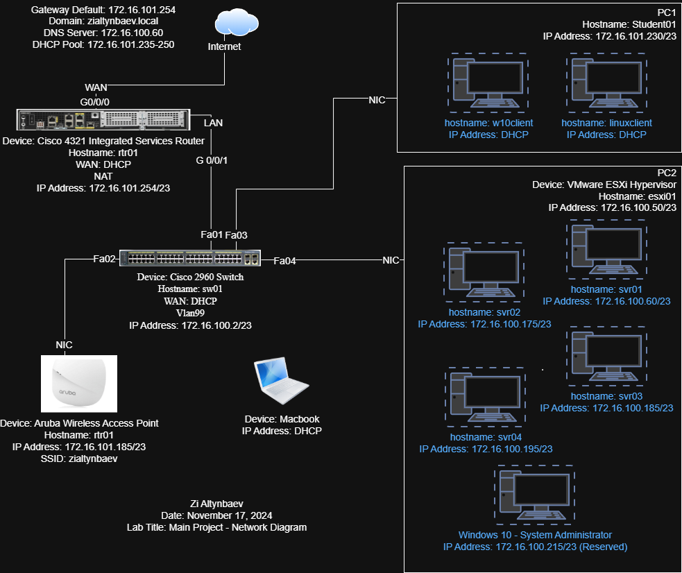

# Enterprise Network Infrastructure

Designed and configured a corporate network environment with routing, switching, wireless, and virtualization.

## Network Diagram

## Architecture
- Cisco 4321 router with Dynamic NAT, DHCP, and default gateway
- Cisco 2960 switch with VLAN 99 segmentation
- Aruba wireless AP with dedicated SSID
- VMware ESXi hypervisor hosting multiple production servers
- Active Directory domain controller with integrated DNS
- Windows and Linux client endpoints

## Technologies Used
- Cisco IOS CLI
- VMware ESXi
- Windows Server (Active Directory, DNS, DHCP)
- Linux
- Aruba Wireless
- VLANs, NAT, DHCP
